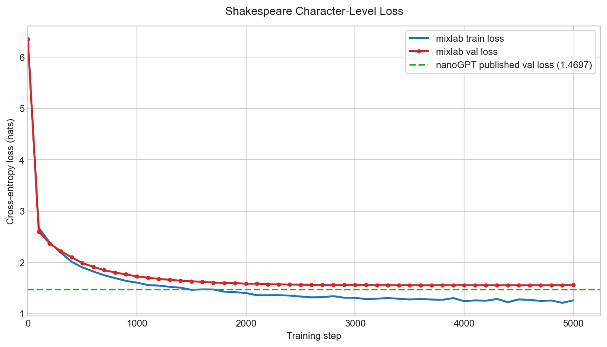

# Shakespeare Character-Level Benchmark

This benchmark validates that mixlab's training pipeline produces correct,
stable convergence on a well-known dataset. It uses nanoGPT's published
Shakespeare result as a reference point — not a parity target.

## What Is Compared

The reference is Andrej Karpathy's `karpathy/nanoGPT` Shakespeare character-level run:

- Repository: `https://github.com/karpathy/nanoGPT`
- Commit referenced: `3adf61e154c3fe3fca428ad6bc3818b27a3b8291`
- Config: `config/train_shakespeare_char.py`
- Published README result: best validation loss `1.4697`
- Architecture: `n_layer=6`, `n_head=6`, `n_embd=384`, `block_size=256`, `dropout=0.2`
- Training: `learning_rate=1e-3`, `max_iters=5000`, `batch_size=64`

The mixlab config in [`gpt2_small.json`](gpt2_small.json) matches the same
depth, heads, model dimension, MLP expansion, context length, dropout,
learning rate, batch size, and step count.

**Important:** This is not an apples-to-apples comparison. nanoGPT maps the
65 unique Shakespeare characters to a compact vocabulary, while mixlab uses
byte-level token IDs (`vocab_size=256`). The larger vocabulary wastes embedding
capacity on unused byte positions, which accounts for most of the ~0.08 loss
gap. The purpose of this benchmark is to demonstrate stable convergence and
reasonable loss, not to claim parity.

## Reproduce

From the mixlab repo root:

```bash
./benchmarks/run.sh
```

The script:

1. Downloads `input.txt` from `karpathy/char-rnn` (~1.1 MB).
2. Splits the raw bytes 90/10 into train and validation shards.
3. Trains mixlab with the matched config.
4. Writes `benchmarks/results/shakespeare_train.log`.
5. Extracts `benchmarks/results/shakespeare_loss.csv`.
6. Generates `benchmarks/results/shakespeare_loss.png` when `matplotlib` is installed.

## Results

| Run | Steps | Best val loss | Final val loss | Tokens/sec | Notes |
| --- | ---: | ---: | ---: | ---: | --- |
| nanoGPT published | 5000 | 1.4697 | 1.4697 | — | A100, compact 65-char vocab |
| mixlab plain transformer | 5000 | 1.5527 | 1.5581 | ~37,900 | M1 Max, byte vocab (256), 36 min |

The 0.08 gap is expected: byte-level tokenization (256 IDs) wastes capacity
on unused byte positions compared to nanoGPT's compact 65-character vocabulary.
Validation loss is stable from step 3000 onward with no overfitting.



## Hardware and Software Notes

- mixlab commit: `git rev-parse HEAD`
- nanoGPT reference commit: `3adf61e154c3fe3fca428ad6bc3818b27a3b8291`
- OS and accelerator
- Go version: `go version`
